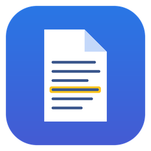
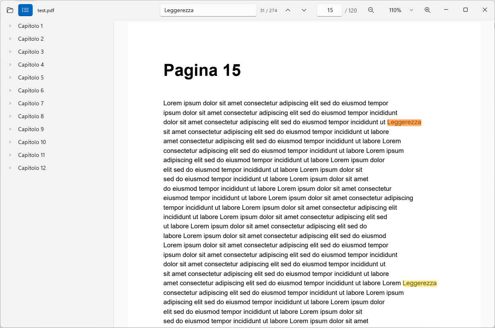

<p align="center">
  
</p>

<h1 align="center">Lieve</h1>

<p align="center">
  Un lettore PDF leggero, moderno e senza fronzoli per Windows 11.<br>
  Niente pubblicità, niente account, niente telemetria, niente connessioni di rete.
</p>

<p align="center">
  <a href="../../releases/latest"><b>Scarica l'ultima versione</b></a>
</p>



## Perché

Adobe Acrobat Reader è pesante e pieno di pubblicità e inviti all'abbonamento. Le alternative
leggere (SumatraPDF) hanno un'interfaccia datata, quelle moderne sono spesso closed source o
spingono versioni a pagamento. Lieve fa una cosa sola, leggere PDF, con l'interfaccia nativa di
Windows 11 e usando solo componenti di fonte autorevole:

- **PDFium**, il motore PDF di Google Chrome, per il rendering e la ricerca nel testo;
- **WinUI 3 / Windows App SDK**, il framework ufficiale Microsoft per le app di Windows 11;
- **.NET** compilato in **Native AOT**: un unico eseguibile nativo, nessun runtime da installare.

Tutto il resto (circa 1.700 righe di C#) è in questo repository e si legge in un pomeriggio.

## Funzionalità

- Apertura istantanea (la finestra compare in circa 0,4 secondi), scorrimento continuo con
  rendering solo delle pagine visibili.
- Ricerca nel testo con evidenziazione di tutti i risultati, risultato corrente in arancione,
  navigazione avanti/indietro. La ricerca parte dalla pagina che stai leggendo e scorre il
  documento in background senza bloccare l'interfaccia.
- Zoom: adatta larghezza, adatta pagina, percentuali, Ctrl + rotellina centrato sul puntatore.
- Indice (segnalibri del PDF) nella barra laterale.
- Vai a pagina, PDF protetti da password, pagine ruotate e di formati misti.
- Ricorda gli ultimi file aperti, con pagina e zoom di ciascuno.
- Tema chiaro/scuro di sistema, sfondo Mica, barra del titolo integrata, interfaccia che si
  compatta da sola nelle finestre strette, trascina e rilascia per aprire.
- Il file aperto non viene mai bloccato: puoi modificarlo, spostarlo o cancellarlo mentre è aperto.

## Installazione

1. Scarica `Lieve-win-x64.zip` (o `Lieve-win-arm64.zip` per PC ARM) dalla
   [pagina delle release](../../releases/latest) ed estrailo dove preferisci, ad esempio in
   `%LOCALAPPDATA%\Programs\Lieve`.
2. Avvia `Lieve.exe`.

Lieve usa il **Windows App Runtime 1.8**, un componente Microsoft condiviso che molte app
hanno già installato. Se manca, all'avvio Windows propone di scaricarlo; in alternativa:

```bash
winget install Microsoft.WindowsAppRuntime.1.8
```

Non serve altro: niente .NET da installare, niente diritti di amministratore.

### Usarlo come lettore PDF predefinito

Dalla cartella di Lieve esegui:

```bash
powershell -ExecutionPolicy Bypass -File .\register.ps1
```

Lo script registra Lieve solo per il tuo utente (scrive in `HKEY_CURRENT_USER`, non tocca il
sistema) e apre **Impostazioni › App › App predefinite**, dove basta scegliere Lieve per i
file `.pdf`. Windows 11 non permette a nessun programma di impostarsi da solo come predefinito,
quest'ultimo passaggio è per forza manuale. Per annullare: `.\register.ps1 -Unregister`.

In alternativa: tasto destro su un PDF › *Apri con* › *Scegli un'altra app* › *Cerca un'app
nel PC* › `Lieve.exe`.

## Scorciatoie da tastiera

| Tasti | Azione |
|---|---|
| `Ctrl+O` | Apri un file |
| `Ctrl+F` | Cerca nel documento |
| `Invio` / `Maiusc+Invio` (nella ricerca) | Risultato successivo / precedente |
| `F3` / `Maiusc+F3` | Risultato successivo / precedente |
| `Esc` (nella ricerca) | Chiudi la ricerca |
| `Ctrl+G` | Vai a pagina |
| `Ctrl++` / `Ctrl+-` / `Ctrl+rotellina` | Ingrandisci / riduci |
| `Ctrl+0` | Zoom 100% |
| `Ctrl+1` / `Ctrl+2` | Adatta larghezza / adatta pagina |
| `Pag↑` `Pag↓` `Home` `Fine` `frecce` | Scorri |
| `F11` | Schermo intero |
| `Ctrl+W` | Chiudi il documento |

## Riga di comando

```bash
Lieve.exe "documento.pdf" --page 12 --search "parola"
```

`--page` apre alla pagina indicata (partendo da 1), `--search` avvia subito una ricerca.

## Privacy e sicurezza

- **Nessuna connessione di rete.** Il codice di Lieve non contiene richieste di rete, e PDFium
  è compilato senza JavaScript (V8) e senza XFA: i PDF non possono eseguire codice.
- **Nessuna telemetria**, nessun account, nessun aggiornamento automatico.
- Gli unici file che Lieve scrive sono in `%LOCALAPPDATA%\Lieve`: `recent.json` (ultimi file
  aperti, con pagina e zoom) e, solo in caso di errore imprevisto, `crash.log`.
  Cancellare la cartella azzera tutto.
- I binari delle release sono compilati da GitHub Actions direttamente da questo codice
  sorgente ([workflow](.github/workflows/build.yml)); ogni release include `SHA256SUMS.txt`.

### Da dove vengono i componenti

| Componente | Autore | Note |
|---|---|---|
| `pdfium.dll` | Google (PDFium) | binari precompilati da [bblanchon/pdfium-binaries](https://github.com/bblanchon/pdfium-binaries), il pacchetto NuGet più usato per PDFium, costruito in CI pubblica dal sorgente ufficiale di Google |
| WinUI 3 / Windows App Runtime | Microsoft | runtime condiviso firmato Microsoft |
| Runtime .NET (dentro `Lieve.exe`) | Microsoft / .NET Foundation | compilato in Native AOT |

Licenze complete in [THIRD-PARTY-NOTICES.md](THIRD-PARTY-NOTICES.md).

## Prestazioni

Misurate su Windows 11, documento di prova di 120 pagine:

| | |
|---|---|
| Dimensione installata | ~16 MB (`Lieve.exe` 7 MB + `pdfium.dll` 7 MB + risorse) |
| Avvio a finestra visibile | ~0,4 s |
| Memoria (working set) con documento aperto | ~130–150 MB |

Buona parte della memoria è il costo fisso di WinUI. Le pagine vengono renderizzate solo
quando entrano nello schermo e liberate quando escono, quindi la memoria non cresce con la
lunghezza del documento.

## Limiti attuali

Lieve è pensato per **leggere**. Per ora non fa:

- selezione e copia del testo;
- stampa;
- annotazioni, evidenziazioni, firme, compilazione dei moduli (i moduli già compilati
  vengono comunque visualizzati);
- miniature delle pagine, più documenti in schede.

Sono tutte cose che PDFium supporta: le aggiungerò se e quando servono.

## Compilare dal sorgente

Requisiti:

- [.NET 10 SDK](https://dotnet.microsoft.com/download)
- per la build di rilascio (Native AOT): Visual Studio 2022 Build Tools con il workload
  *Sviluppo di applicazioni desktop con C++* (serve il linker MSVC)

Non serve Visual Studio completo.

```bash
# Esegui in debug
dotnet run --project src/Lieve

# Build di rilascio, Native AOT (output in dist/Lieve)
dotnet publish src/Lieve -c Release -r win-x64 -o dist/Lieve
```

Ogni push su `main` viene compilato da GitHub Actions per x64 e ARM64; un tag `v*` crea
automaticamente una release con gli zip.

### Struttura del codice

```
src/Lieve/
├── App.xaml(.cs)            avvio, riga di comando, log degli errori
├── MainWindow.xaml(.cs)     interfaccia: barra, zoom, ricerca, indice, scorciatoie
├── Viewer/
│   ├── PageLayout.cs        layout virtualizzato: posizioni esatte di ogni pagina
│   └── PageView.cs          una pagina a schermo: bitmap + evidenziazioni
├── Pdf/
│   ├── Pdfium.cs            binding P/Invoke a pdfium.dll
│   ├── PdfWorker.cs         thread dedicato: PDFium non è thread-safe
│   └── PdfDocument.cs       apertura, rendering, ricerca, indice
├── Recents.cs               file recenti (JSON in %LOCALAPPDATA%\Lieve)
└── WindowMinSize.cs         dimensione minima della finestra
scripts/register.ps1         associazione ai file .pdf per l'utente corrente
```

Scelte principali:

- Tutte le chiamate a PDFium passano da un **unico thread** dedicato con una coda; le richieste
  di rendering di pagine uscite dallo schermo vengono scartate prima di essere eseguite.
- Il layout conosce **in anticipo la dimensione di ogni pagina**, quindi "vai a pagina", zoom e
  scorrimento verso i risultati sono esatti anche su documenti di migliaia di pagine, senza stime.
- Le pagine vengono renderizzate alla **risoluzione reale dello schermo** (DPI inclusi), per
  testo nitido a qualsiasi zoom.
- Il file viene letto a blocchi tramite l'accesso personalizzato di PDFium, senza caricarlo
  tutto in memoria e senza bloccarlo.

## Licenza

[MIT](LICENSE). PDFium e gli altri componenti hanno le proprie licenze permissive, vedi
[THIRD-PARTY-NOTICES.md](THIRD-PARTY-NOTICES.md).
